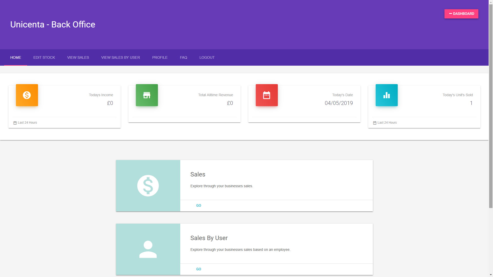
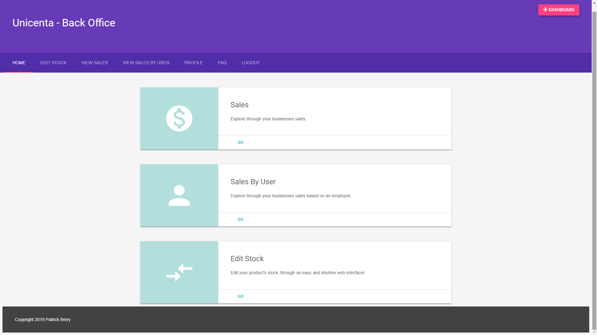
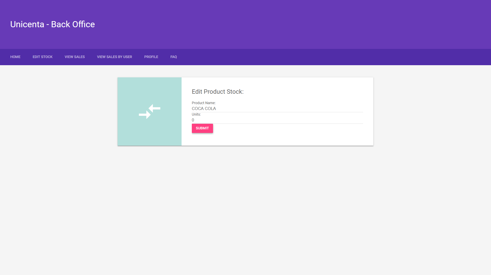

# unicenta-backoffice

## What is Unicenta Back-Office?
### Unicenta Back-office is a web back end for Unicenta. It provides features such as:
- Dash Board for checking sales at anytime remotely (Web Server Required)
- Sales reports
- User Based Sales Reports
- Edit Stock






### These are the current features, however i am planning on adding new features and updating this project regularily. I plan to add features such as:
- Staff TimeTable portal so that store owners can directly input staff members timetable so that they can view it from home.
- Charts for the dashboard.

### If you have any suggestions or feature requests for this project, please email me at: berrypatrick94@gmail.com

## Requirements:
- A Webserver that will serve the pages
- Remote Mysql Server connection (Information for how do to this can be found here: https://www.cyberciti.biz/tips/how-do-i-enable-remote-access-to-mysql-database-server.html)
- Unicenta Connected to the MYSQL Database
- Unicenta 4.4.2 Up (However i do have a version of this for versions before 4.4.2, this is available on request, Email me!)


## How do i install Unicenta Back-Office?

### To install, download and extract the zip file into your webservers 'WWW' Directory.

### Then open the db.php file and add your database's connection information as seen below:
```
$dbhost = "10.0.0.1";
$dbname = "POS";
$dbuser = "root";
$dbpass = "password";
```
### From within this file you can also configure items such as:
- Page Name
- Header Title
- Currency
- Admin Name
- Gender

### After this, in your browser type in your webservers IP address or Domain Name along with the 'Back-Office' and 'install' sub-directory in the URL.
### e.g 10.0.0.1/Back-Office/install

### You will now be Directed to an install page.
### After the install is complete, the final page will ask you to delete the 'Install' folder.
### Delete this folder and your good to go!

